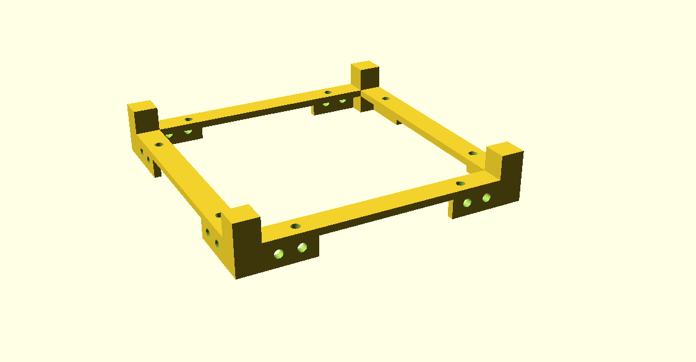

# OpenSCAD_MyChassisModeling
A simplified modeling of the top-part chassis for measuring-purpose fabrication.

# To-Do list

- [ ] Add the technical description PDF / Presentation

# The current design

Current version: OpenSCAD_MyChassisModeling-Aug0923-ver03

### With diamond cut on top

### Without diamond cut on top

---

##### :satellite: :space_invader: :beer: Designed by M.T. :satellite: :space_invader: :beer:
